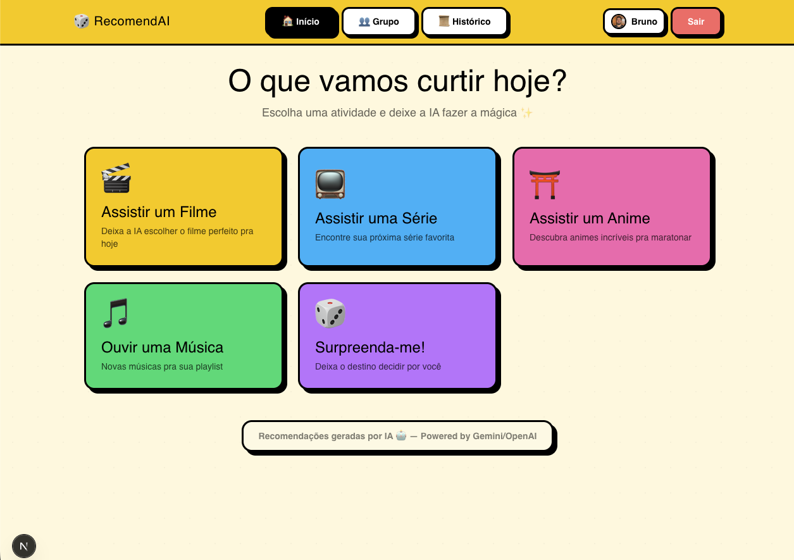
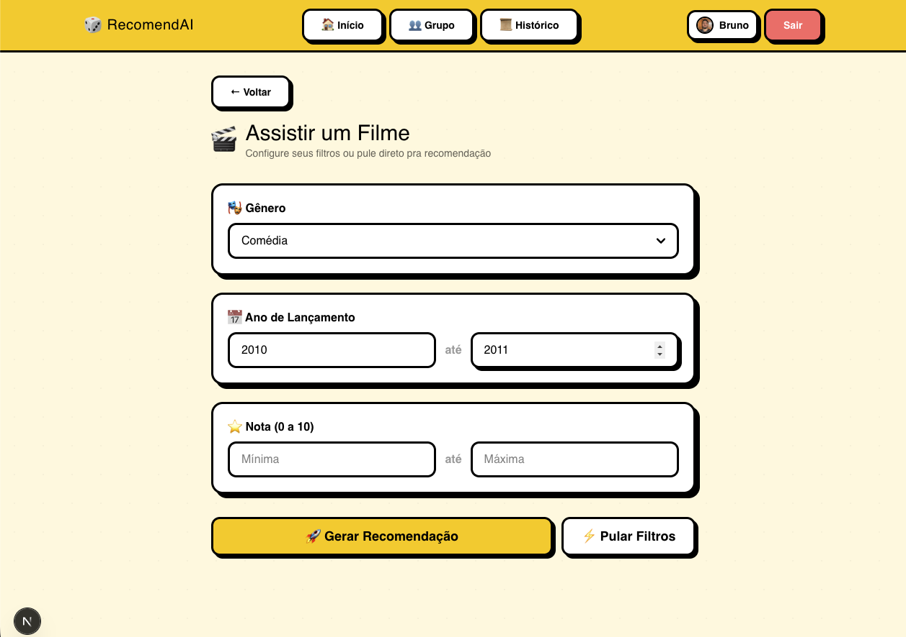
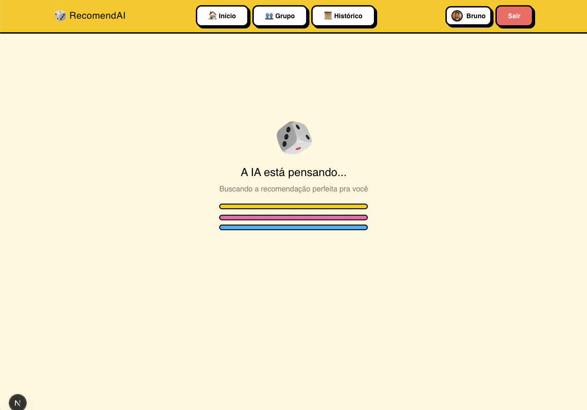
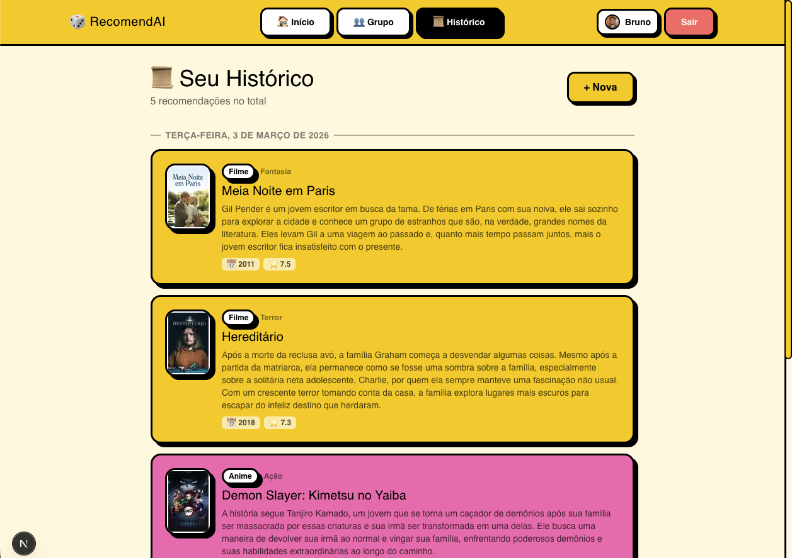

# RecomendAI

RecomendAI is an AI-powered entertainment picker that helps you discover movies, TV shows, animes, and music based on your preferences. Built with a neobrutalism design in Brazilian Portuguese.



## Features

- **AI-Powered Recommendations** - Uses Gemini/OpenAI to generate personalized suggestions
- **Multiple Categories** - Movies, TV Shows, Animes, Music, or "Surprise Me!" (random)
- **Smart Filters** - Genre, release year, rating, seasons, episodes, and language filters depending on category
- **Recommendation History** - All recommendations are saved and browsable by date
- **Group Rooms** - Create shared rooms with friends to get recommendations that suit everyone
- **Authentication** - Google OAuth and email/password login
- **Rate Limiting** - Daily recommendation limits per user
- **No Duplicates** - Previously recommended items are sent to the AI to avoid repeats

## Screenshots

| Filters | AI Thinking | Result |
|---------|-------------|--------|
|  |  |  |



## Tech Stack

- **Framework** - [Next.js 16](https://nextjs.org/) with Turbopack
- **Styling** - [Tailwind CSS 4](https://tailwindcss.com/)
- **Database** - PostgreSQL with [Drizzle ORM](https://orm.drizzle.team/)
- **Auth** - [NextAuth.js v5](https://authjs.dev/) (Google + Credentials)
- **AI** - [Google Gemini](https://ai.google.dev/) / [OpenAI](https://openai.com/)
- **Language** - TypeScript

## Getting Started

### Prerequisites

- Node.js 18+
- PostgreSQL database
- Google OAuth credentials (optional, for Google login)
- Gemini API key and/or OpenAI API key

### Setup

1. Clone the repository:

```bash
git clone https://github.com/buemura/ai-entertainment-picker.git
cd ai-entertainment-picker
```

2. Install dependencies:

```bash
npm install
```

3. Copy the environment file and fill in your values:

```bash
cp .env.example .env
```

4. Push the database schema:

```bash
npm run db:push
```

5. Start the development server:

```bash
npm run dev
```

The app will be available at [http://localhost:3000](http://localhost:3000).

### Available Scripts

| Command | Description |
|---------|-------------|
| `npm run dev` | Start dev server with Turbopack |
| `npm run build` | Production build |
| `npm run start` | Start production server |
| `npm run db:generate` | Generate Drizzle migrations |
| `npm run db:migrate` | Run Drizzle migrations |
| `npm run db:push` | Push schema to database |
| `npm run db:studio` | Open Drizzle Studio |
